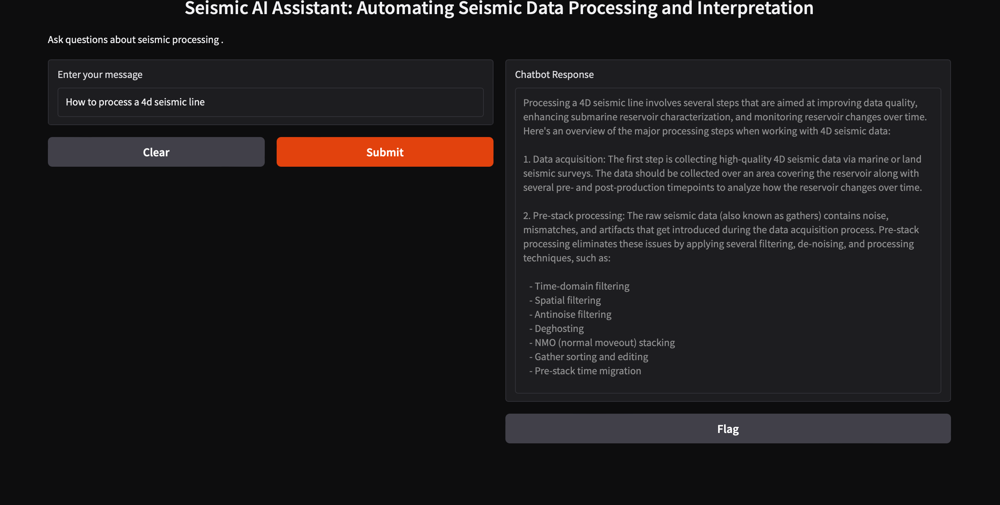
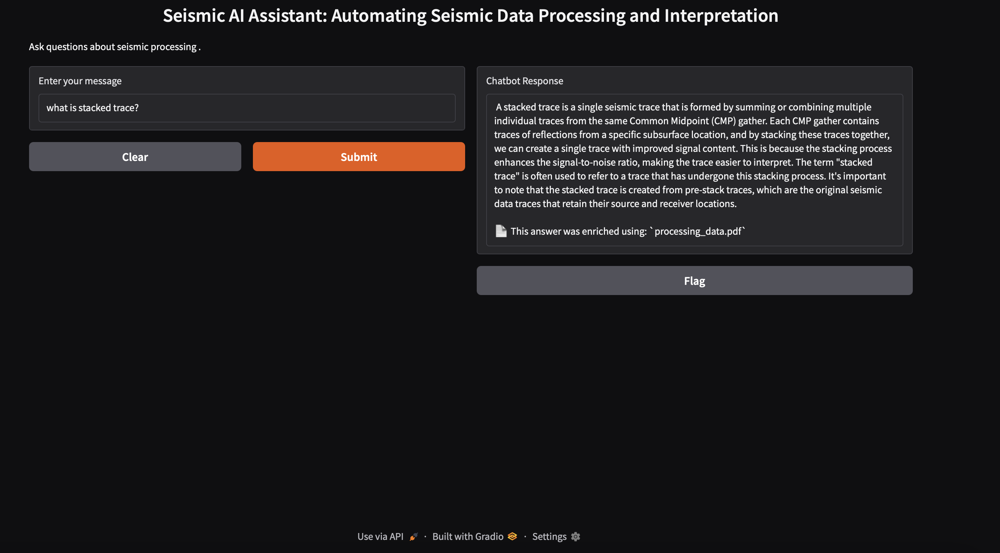
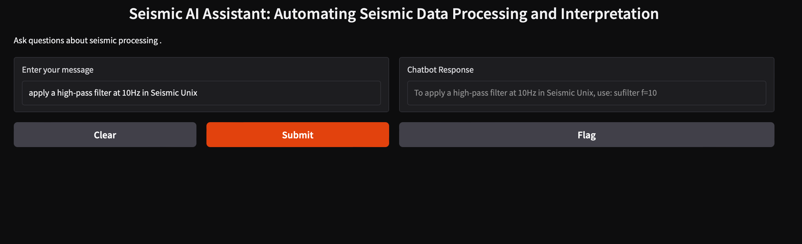
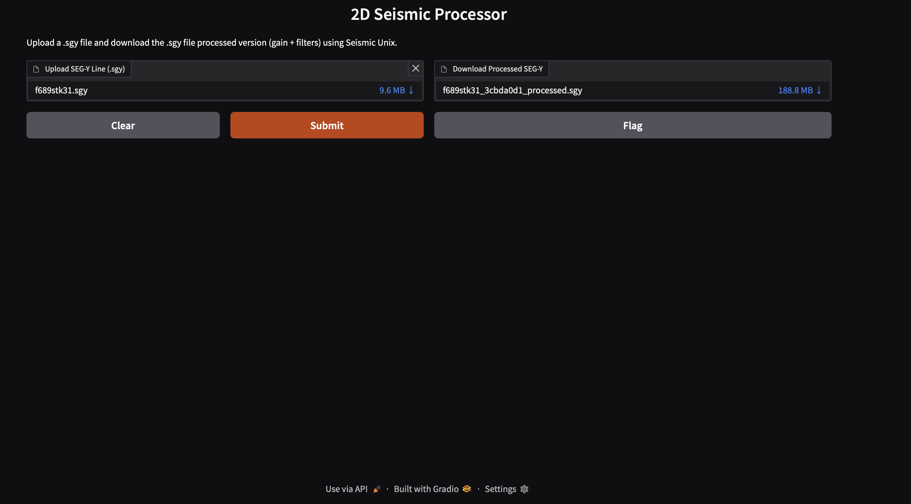

# Seismic AI Assistant: Automating Seismic Data Processing and Interpretation

Seismic AI Chatbot is a specialized assistant designed to automate seismic data processing and interpretation. It integrates **Hugging Face Transformers**, **LangChain**, **Gradio**, **RAG (Retrieval-Augmented Generation)**, and **Chroma** for an intelligent, document-aware interface.

This project supports both **Hugging Face API inference** and **retrieval from domain-specific seismic documentation**, including **Seismic Unix command references**.

---

## 🧠 What's New

- 📄 **Now indexes domain documents**, including `SeismicUnix.docx`, enabling the chatbot to suggest commands like `sugain`, `sufilter`, `suximage`, etc.
- 📊 **Evaluation modules** (`evaluation.py`, `evaluation_metrics.ipynb`, `test_embeddings.py`) to test embedding quality and chatbot performance.
- 🧪 **Improved RAG logic**: if relevant context is found, it is injected in the prompt to the LLM. Otherwise, the fallback model response is used.

---

## Features

- Uses **Mistral-7B-Instruct** model via Hugging Face API.
- Answers questions about **Seismic Unix commands and processing workflows**.
- Performs **document-aware retrieval** with **Chroma vector store** and **RAG**.
- Provides a **simple UI** with **Gradio**.
- ⚙️ Supports embedding regeneration and live testing.

## New Feature: Seismic Processor Web App (Gradio)

We have added a Gradio web application that allows you to upload a `.segy` file, process it using Seismic Unix, and download the resulting processed `.segy` file.


---

## Installation & Setup

### 1️⃣ Clone the Repository
```bash
git clone https://github.com/AlejandraRocks/Seismic-AI-Assistant.git
cd Seismic-AI-Assistant
```

### 2️⃣ Install Dependencies
```bash
pip install -r requirements.txt
```

### 3️⃣ Set Hugging Face API Key
```bash
export HF_API_KEY="your_huggingface_api_key"
```
On Windows:
```cmd
setx HF_API_KEY "your_huggingface_api_key"
```

### 4️⃣ Run the Chatbot
```bash
python chatbot.py
```

### 5 Project Structure
```
/Seismic-AI-Assistant
│
├── chatbot.py                  # Main chatbot using RAG + HuggingFace API for answering seismic questions
│
├── dataset/                    # Indexed documentation used for retrieval
│   ├── SeismicUnix.docx        # Primary document with Seismic Unix commands
│   └── processing_data.pdf     # Additional reference on seismic data processing
│
├── evaluation.py               # Script to evaluate chatbot's retrieval performance
├── evaluation_metrics.ipynb    # Notebook for testing and visualizing embedding quality
├── test_embeddings.py          # Tool to test similarity between embedded text chunks
├── fine_tuned.py               # Script to fine-tune Mistral-7B model using LoRA
│
├── src/
│   └── seismic_processor.py    # Core function to run Seismic Unix shell script and return processed SEG-Y
│
├── input_seismic-lines/        # Directory where SEG-Y files are uploaded for processing
├── output_seismic-lines/       # Directory storing output .su and converted .segy files
│
├── seismic_processing.sh       # Bash script to convert SEG-Y to SU, apply gain/filter, and export processed data
├── app.py                      # Gradio app interface to upload SEG-Y files and download processed outputs
│
├── requirements.txt            # Python dependencies
├── README.md                   # Project documentation
└── .gitignore                  # Files and folders to ignore in Git versioning
```

---

## 🧪 Evaluation Tools

You can test if embeddings are matching user questions with:

```bash
python test_embeddings.py
```

Run the metrics notebook:

```bash
jupyter notebook evaluation_metrics.ipynb
```

---

## 🔍 Example: How RAG Works

When you ask:

```
How do I apply a gain function in Seismic Unix?
```

The assistant searches the indexed `SeismicUnix.docx`, finds mentions of `sugain`, and constructs a contextual prompt. It then asks the LLM:

> “With this context: `sugain is used for gain control with parameters agc=...`, how would you answer the user?”

---

## 💻 UI with Gradio

To interact through the UI:

```bash
python chatbot.py
```

You’ll get a link like:

```
Running on local URL: http://127.0.0.1:7860
```

## Example UI Screenshot



---

## 🧪 Optional: Running Fine-Tuning Locally

If you'd like to fine-tune the Mistral-7B model using your own seismic question-answer dataset, this project includes an optional `fine_tuned.py` script that applies **LoRA (Low-Rank Adaptation)** for efficient training.

### Requirements:
- A GPU-enabled environment (local or cloud)
- Custom dataset in JSON format (`dataset.json`)
- Sufficient memory (recommended: 16GB+ RAM, 1 GPU with 12GB VRAM)

### To run local fine-tuning:
```bash
python fine_tuned.py
```

The model will be fine-tuned using your dataset and saved to:

```
/trained-model/
```

You can then manually upload it to the Hugging Face Hub and modify the chatbot to use the new model via `InferenceClient`.

> Note: The chatbot (`chatbot.py`) by default still uses the public Mistral model. If you upload your fine-tuned model to Hugging Face, update the model path in the script accordingly.

---

## Contributing

Pull requests are welcome! Contributions for additional seismic datasets or embedding improvements are appreciated.

---

## License

MIT License.

---

### 🌎 Developed for Geoscientists & Seismic Engineers

## New Feature: Seismic Processor Web App (Gradio)

We have added a Gradio web application that allows you to upload a `.segy` file, process it using Seismic Unix, and download the resulting processed `.segy` file.

### How it works

- The app is located in `app.py`.
- Upon uploading a `.segy` file:
  1. The backend script (`seismic_processor.py`) runs a shell script that:
     - Converts the `.segy` file to `.su`.
     - Applies basic processing (e.g., gain and band-pass filtering).
     - Converts it back to `.segy`.
  2. The processed `.segy` file is returned for download via the app.

### Usage

To launch the app locally:

```bash
python app.py
```

Then open the interface in your browser, upload a `.segy` file, and download the processed version.
